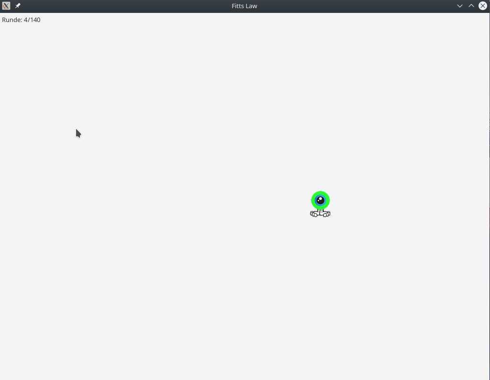

# FittsLaw
In diesem Teil der Studienarbeit soll das Fitts Gesetz von Paul Fitts in einer Applikation umgesetzt werden.
Gewählt wurde die Programmiersprache Kotlin und das Framework JavaFX. 
Eine vorgebaute Jar-Datei für das OpenJDK 11 oder OpenJDK 12 liegt im jar/ Verzeichnis des Projekts

Befehl zum Ausführen: `java -jar FittsLaw.jar --add modules=javafx.controls`
 
## Unterstützte Features
* Experiment-Fenster mit Auflösung 1024 * 768
* Start durch Klick auf Kreis nach Verzögerung zwischen 500ms und 3500ms
* Klick auf Monster zeigt Kreis erneut
* Nach 140 Runden wird Experiment automatisch beendet
* Fortschrittslabel zeigt aktuelle Runde (Runde 4/140)
* Logger, welcher Runden-Nummer, Millisekunden, Abstand in Pixeln, 
Scalierung des Bilds und Verzögerung im CSV Format ausgibt
* Message-Objekt mit Runden-Infos in Konsole
* Monster kann hat immer einen Abstand von mindestens 20px zum Rand
* Monster hat zufällige Größe von 5px, 10px, 15px, 20px, 30px, 40px oder 50px

## Screenshot

!
